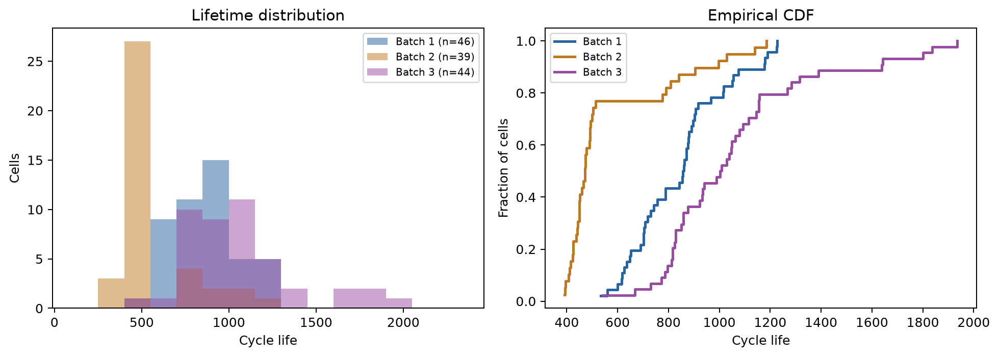
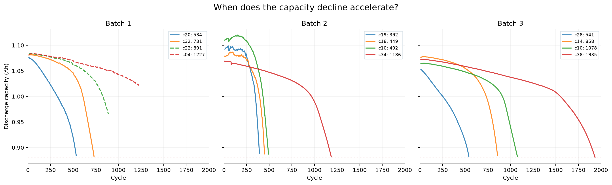
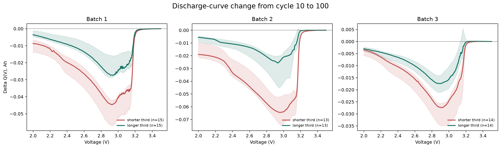
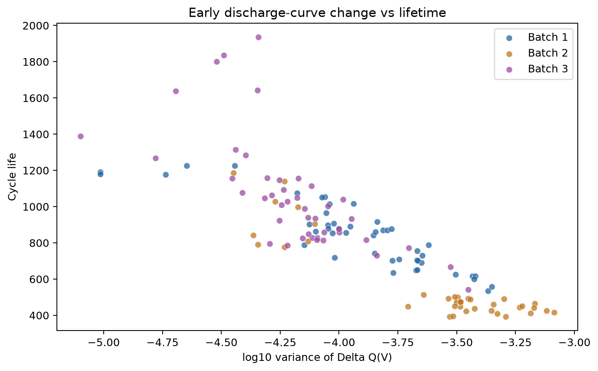
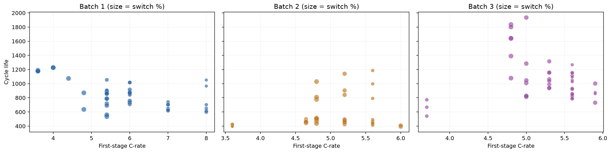
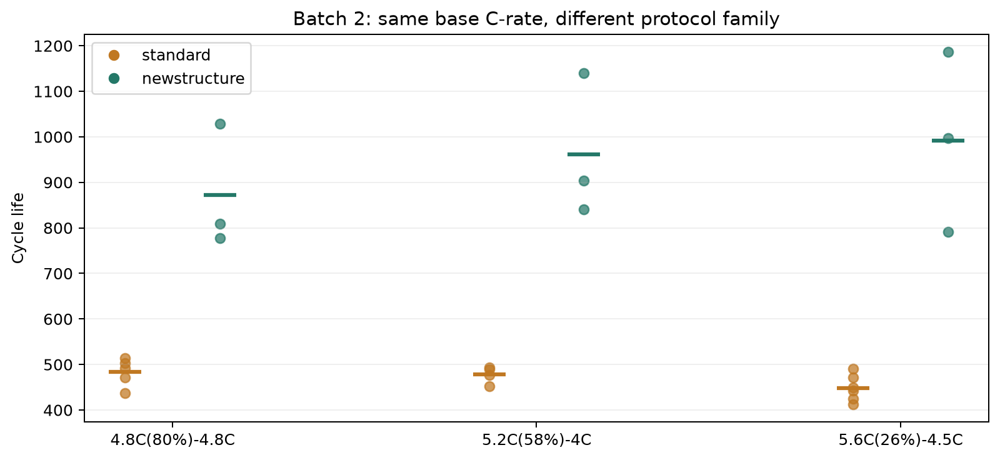
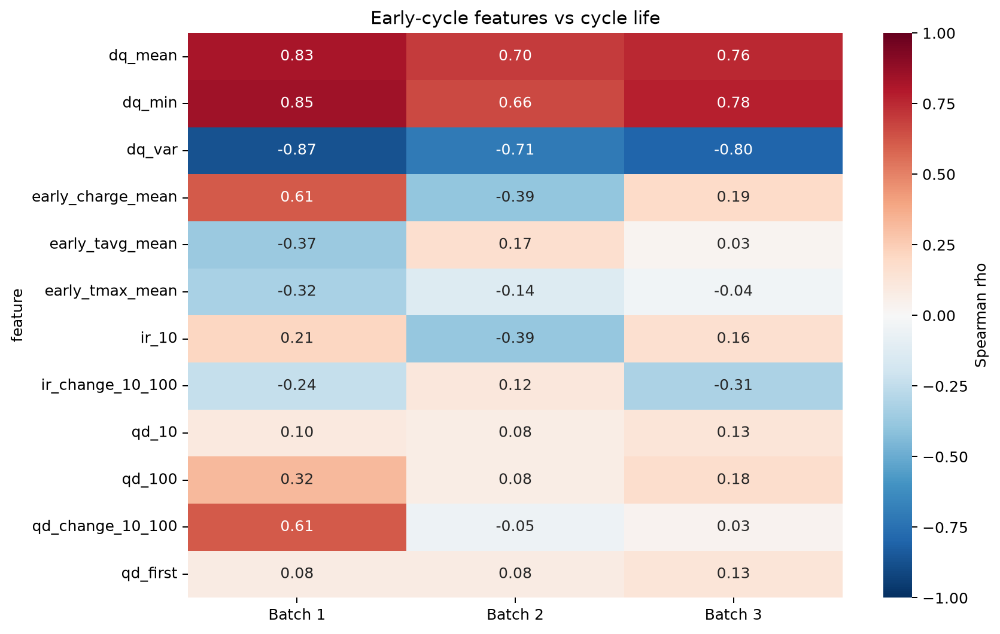

# ESS 배터리 수명 예측 — DAY 1: 데이터 탐색에서 모델 전략까지

**울산캠퍼스 2반 · 안동선**

**제출물:** [가로형 DAY 1 PDF](deliverables/DS-MINI-Design-울산캠퍼스_2반-안동선.pdf)

**오늘의 범위:** Batch 1·2·3 EDA, 데이터 품질 판정, 모델과 검증 계획. 모델 학습과 성능 평가는 DAY 2 범위다.

## 무엇을 결정하려는가

ESS의 교체 계획에서 관심 있는 것은 **초기 100사이클만 본 셀의 이후 수명**이다. [과제의 DAY 1 다섯 질문](https://actually-war-1ea.notion.site/DS-Mini-Project-32d7f4c8669380338a27f90c471c1fcb#32d7f4c866938037b82afc22aecd9d57)을 단순 체크리스트로 다루지 않았다. 각 질문에 대해 **확인 목적 → 수치·그림 → 해석과 반례 → 피처·모델·검증 결정**을 적었다. 강의 전사본과 노션 예시에서 강조한 것도 이 연결이다. 평가 비중은 EDA 50, EDA에서 전략으로의 연결 30, 모델 전략 20이다.

> **오늘의 핵심 판단:** Batch 2의 짧은 수명은 임의의 몇몇 이상치가 아니다. 수명 레이블 39셀 중 일반 프로토콜 30셀의 중앙값은 451사이클이고, `newstructure` 9셀은 904사이클이다. Batch 1의 최단 수명 534사이클보다 짧은 Batch 2 셀은 30/39다. 따라서 DAY 2에는 초기 ΔQ(V) 신호의 예측 가능성을 보되, **훈련 범위 밖 수명·새 프로토콜·라벨 생성 방식 차이**를 최종 테스트 해석의 중심에 둬야 한다.

## 분석 대상과 재현

| 구분 | 원본 파일 | 전체 셀 | 숫자 수명 레이블 | 역할 |
|---|---|---:|---:|---|
| Batch 1 | `2017-05-12_batchdata_updated_struct_errorcorrect.mat` | 46 | 46 | DAY 2 학습 배치 |
| Batch 2 | `2018-02-20_batchdata_updated_struct_errorcorrect.mat` | 47 | 39 | 과제 지정 최종 테스트 배치 |
| Batch 3 | `2018-04-12_batchdata_updated_struct_errorcorrect.mat` | 46 | 44 | 추가 일반화 점검 후보 |
| extra | `2018-04-03_varcharge_batchdata_updated_struct_errorcorrect.mat` | 별도 | — | 과제 대상 외, 분석 제외 |

원본은 HDF5 기반 MATLAB v7.3 파일이다. 3개 대상 배치에서 **139셀, 116,722개 사이클 요약 행**을 추출했다. 셀마다 초기 100사이클과 ΔQ(V) 곡선이 모두 있고, 추출 진단 오류는 0건이다. 다만 숫자 레이블은 129셀에만 있다. **분석 단위는 셀**이며 사이클 행을 독립 표본으로 늘리지 않는다.

```text
mini-project/
├── data/raw/                  # 사용자가 제공한 .mat 원본, Git 제외
│   └── extra/                # 과제 외 varcharge 원본
├── data/processed/            # 셀/사이클/곡선 추출물, Git 제외
├── references/                # 노션 그림·원저자 코드, Git 제외
├── src/extract.py             # 원본 → 셀 피처·전체 열화곡선 분리
├── src/eda.py                 # DAY 1 통계·그림·민감도 분석
├── src/build_day1_pdf.py      # 가로형 제출 PDF
├── results/figures/           # 검토한 그림
├── results/tables/            # 그림 뒤의 검증 가능한 수치
└── deliverables/              # 제출 PDF
```

```bash
python3 -m venv .venv
.venv/bin/pip install -r requirements.txt
.venv/bin/python src/extract.py --batch2 notion
.venv/bin/python src/eda.py
.venv/bin/python src/build_day1_pdf.py
```

Python 3.14.6과 고정된 패키지 버전은 [requirements.txt](requirements.txt)에 있다. 셀 부트스트랩 시드는 91, 정책 단위 부트스트랩 시드는 2026이다. 원본 `.mat`, 가공된 셀 자료, 수업 전사본, 노션 첨부 이미지는 공개 저장소에 올리지 않는다. PDF와 재현용 코드는 공개한다.

### 레이블을 먼저 검증한 이유

수명 분포를 그리기 전에 `cycle_life`가 실제로 **QD < 0.88 Ah의 첫 관측 사이클**인지 확인했다.

| 품질 점검 | Batch 1 | Batch 2 | Batch 3 |
|---|---:|---:|---:|
| 숫자 레이블 / 전체 셀 | 46/46 | 39/47 | 44/46 |
| 숫자 레이블과 실제 첫 0.88 Ah 교차 일치 | 0/46 | **39/39** | 0/44 |
| 숫자 레이블 = 기록 길이 + 1 | **46/46** | 0/39 | **44/44** |
| 마지막 QD ≤ 0.885 Ah인 숫자 레이블 | 36/46 | 39/39 | 44/44 |

Batch 1·3의 숫자 레이블은 기록 종료 직후를 가리킨다. Batch 3의 44셀과 Batch 1의 36셀은 마지막 QD가 0.88 Ah에 **가깝지만 교차를 직접 관측한 것은 아니다**. Batch 1 나머지 10셀은 마지막 QD가 0.913–1.043 Ah여서 잠재적 우측 검열이다. Batch 3의 추가 2셀은 레이블이 없고 마지막 QD가 0.937·0.974 Ah다. Batch 2 레이블 없는 8셀은 `VarCharge` 4셀과 `SLOWCYCLE` 4셀로, 일반 프로토콜 수명 분석에서 제외했다. 그중 두 `SLOWCYCLE` 셀의 마지막 QD가 약 2.17 Ah라 별도 실험/이상 기록으로 취급한다. 이 8셀에 레이블을 대치하지 않는다.

0.885 Ah는 [원저자 처리 코드](https://github.com/rdbraatz/data-driven-prediction-of-battery-cycle-life-before-capacity-degradation/blob/master/LoadData.m)의 종료 근접 점검선을 빌린 것이고 EOL 자체는 0.88 Ah 기준이다. 원저자 코드는 Batch 1의 미완료 10셀 중 5셀을 `2017-06-30` 파일에서 이어 붙이고 5셀을 제외한다. 이번 과제의 Batch 2는 `2018-02-20`이므로 그 처리를 임의로 재현할 수 없다. **Batch 1 학습과 Batch 2 테스트의 목표값 생성 방식이 다를 수 있음**을 DAY 2 성능 격차 해석에 명시해야 한다. 원논문 9.1%와도 동일 분할 재현 비교는 아니다.

피처는 원본의 **물리적 10번·100번 사이클**에서 계산했다. `summary.cycle`과 `Qdlin`은 1번부터 같은 순서이므로 배열 위치는 9와 99다. `ΔQ(V) = Qdlin[99] − Qdlin[9]`이며 각 셀의 동일한 3.5→2.0 V, 1,000점 전압 격자에서 계산한다. 미래 열화곡선·knee·종료 상태는 **설명용 EDA에만 사용**하고 예측 피처로 넣지 않는다.

## Q1. 수명 분포: 짧은 셀은 왜 생겼나?



| 지표 | Batch 1 | Batch 2 | Batch 3 |
|---|---:|---:|---:|
| 레이블 수 | 46 | 39 | 44 |
| 중앙값 | 858.5 | **472** | 1005.5 |
| 범위 | 534–1227 | **392–1186** | 541–1935 |
| 500 미만 | 0 | **28/39** | 0 |
| 1000 초과 | 10/46 | 3/39 | 23/44 |
| 550 이상 | **45/46** | **9/39** | 43/44 |

**관찰과 해석:** Batch 2의 왼쪽 덩어리 30셀은 일반 프로토콜(392–514사이클)이며, 오른쪽 9셀은 `newstructure`(777–1186사이클)다. 두 집단의 중앙값은 451 대 904다. 분포가 둘로 나뉘는 사실은 충전 속도만으로 설명되지 않는다. Batch 2에서 숫자 레이블이 없는 특수 프로토콜 8셀을 포함하면 이 분포 해석이 달라지므로 분모를 고정했다. Batch 1의 종료 미확인 10셀은 긴 수명·낮은 C-rate 쪽에 치우쳐 있어 전체 레이블을 실제 종료 수명으로 보면 분포와 정책 효과가 왜곡될 수 있다.

**모델 결정:** 초기 100사이클 기반 **수명 회귀**를 택한다. 원논문의 550사이클 이진 분류는 초기 5사이클의 별도 문제이고, Batch 1에는 550 미만이 1셀뿐이라 학습부터 불안정하다. Batch 2에는 550 미만이 30셀이다. MAPE와 함께 MAE, `실제 < 534` 구간의 오차, 과대 예측 비율을 보도록 설계한다. Batch 1의 최솟값 534보다 짧은 Batch 2 30셀에 대한 외삽은 주요 위험이다.

## Q2. 용량 열화: knee는 설명력이 있는가?



**관찰:** 처음에는 용량이 비슷해도 하강이 빨라지는 시점은 셀마다 다르다. 7사이클 이동 중앙값으로 노이즈를 완화하고 100사이클 이후 데이터를 두 직선으로 탐색 분할한 휴리스틱은 Batch 1 45/46, Batch 2 39/39, Batch 3 44/44에서 가속 하강 조건을 찾았다. 탐색적 knee의 중앙 위치는 각각 **기록 수명의 76%, 79%, 81%**다. 특히 Batch 2에서 표준 프로토콜은 약 400–500사이클에, `newstructure`는 약 800–1200사이클에 임계값을 지난다. 10사이클 QD와 수명의 상관은 0.10, 0.08, 0.13으로 약하다.

**해석:** 초기 용량의 절댓값보다 **초기 변화의 형태**가 더 유용할 가능성이 있다. knee 위치는 분할 규칙·스무딩에 의존하고 전체 미래 곡선을 보고 얻은 값이므로 확정적 물리 지표가 아니다. Batch 1·3은 임계값을 직접 지난 기록이 없어서 knee 분모인 숫자 수명도 근사적이다.

**모델 결정:** knee를 학습 피처로 쓰지 않는다. 사후 오류 분석에서만 사용한다. 초기 10→100사이클 변화와 전압 곡선 변화로 신호를 만든다.

## Q3. 초기 ΔQ(V): 무엇이 일찍 드러나는가?





**관찰:** 세 배치 모두 수명이 짧은 1/3 그룹의 ΔQ(V)가 약 2.8–3.1 V에서 더 음수다. `log10(var(ΔQ))`와 수명의 Spearman 상관은 **Batch 1 −0.87**(셀 부트스트랩 95% −0.94~−0.74), **Batch 2 −0.71**(−0.86~−0.43), **Batch 3 −0.80**(−0.90~−0.62)이다. Batch 1의 종료 미확인 10셀을 제외해도 −0.83(n=36)이다.

**반례와 해석:** 정책별 평균을 제거하면 상관은 **−0.15 / −0.33 / −0.47**로 약해진다. 정책을 단위로 재표집한 이 내부 상관의 95% 구간은 Batch 1에서 **−0.50~+0.22**로 0을 지난다. 즉 ΔQ 전체 상관에는 충전 정책 사이의 차이가 섞여 있다. 또 Batch 1에서 ΔQ 평균과 분산은 서로 ρ=−0.97, ΔQ 최솟값과 분산은 −0.99로 거의 같은 정보를 담는다.

**모델 결정:** `log10(var(ΔQ))` 하나를 첫 곡선 피처 후보로 둔다. 평균/최솟값은 **대체 후보**로 비교한다. `ΔQ만`, `정책만`, `ΔQ+정책` 제거 실험으로 신호의 독립 기여를 판단할 계획이다. 세 배치에서 상관 방향이 같아도 새 프로토콜 예측 성능을 보장하지는 않는다.

## Q4. C-rate: 빠르면 정말 수명이 짧은가?





**관찰:** 첫 단계 C-rate와 수명의 상관은 Batch 1 **−0.48**, Batch 2 **+0.06**, Batch 3 **−0.23**이다. Batch 1에서 종료 미확인 10셀을 제외하면 −0.24로 약해진다. Batch 2에서는 동일한 기본 C-rate 문자열을 가진 세 정책 쌍을 비교할 수 있다.

| Batch 2 기본 정책 | 일반형 평균 수명 | `newstructure` 평균 수명 | 차이 |
|---|---:|---:|---:|
| `4.8C(80%)-4.8C` | 483.6 (5셀) | 871.7 (3셀) | +388.1 |
| `5.2C(58%)-4C` | 477.8 (4셀) | 961.7 (3셀) | +483.9 |
| `5.6C(26%)-4.5C` | 448.5 (6셀) | 991.3 (3셀) | +542.8 |

**해석:** 같은 표면적 C-rate라도 수명이 수백 사이클 차이 난다. `newstructure`가 정확히 어떤 실험 조건을 함께 바꿨는지 원본 정책 문자열만으로는 분리할 수 없으므로 구조의 **인과효과라고 단정하지 않는다**. Batch 1과 Batch 2가 공유하는 완전 동일 정책은 2개, Batch 1과 Batch 3은 0개다. Batch 1은 23정책·46셀로 대부분 정책당 2셀이라 정책별 평균 자체의 불확실성이 크다.

**모델 결정:** 정책 문자열을 첫/둘째 C-rate와 전환 SOC로 파싱하되, Batch 1에 없는 `newstructure` 표시를 일반화 가능한 학습 효과처럼 쓰지 않는다. 정책 단위 홀드아웃으로 미지 정책 적응성을 점검하고, Batch 2 최종 오류를 일반형 30셀과 `newstructure` 9셀로 나눠 진단한다. 특수 프로토콜은 라벨이 없으므로 평가 점수 분모에서 제외한다.

## Q5. 초기 피처: 연관성과 중복은 어떤가?



| 피처–수명 Spearman ρ | Batch 1 | Batch 2 | Batch 3 | 결정 |
|---|---:|---:|---:|---|
| ΔQ 분산 | **−0.87** | **−0.71** | **−0.80** | 핵심 후보 |
| QD 10 | +0.10 | +0.08 | +0.13 | 단독 신호 약함 |
| QD 변화 10→100 | +0.61 | −0.05 | +0.03 | 배치 이동에 불안정 |
| 평균 충전 시간 | +0.61 | **−0.39** | +0.19 | 정책 대리 변수 가능 |
| 평균 온도 | −0.37 | +0.17 | +0.03 | 주 모델에서 보류 |
| IR 변화 10→100 | −0.24 | +0.12 | −0.31 | 보조 후보, 안정성 재검토 |

**해석:** 충전 시간과 QD 변화는 Batch 1에서는 강해 보여도 Batch 2에서 방향 또는 크기가 바뀐다. 초기 QD, 온도, ΔQ 분산의 **배치별 중앙값도 이동**한다. 예를 들어 log10 ΔQ 분산은 −3.85/−3.49/−4.18, QD 10은 1.082/1.098/1.068 Ah다. 원시 용량·온도가 배치를 식별하는 지름길로 작동할 수 있다. Batch 1의 평균·최고 온도끼리의 상관은 +0.95다. 강한 상관은 인과적 피처 중요도가 아니다.

**모델 결정:** 46개 학습 셀에 맞춰 소수 피처를 사용한다. ΔQ 요약값 중 하나, 정책 수치 표현, 초기 QD/IR 변화만 후보군으로 두고, 온도·충전 시간은 제거 실험에서만 검토한다. 정규화·결측값 대치·피처 선택은 향후 각 **학습 폴드 안에서만 fit**한다.

## DAY 1 모델 설계 결정

| 관찰 | 의미 | DAY 2에 실행할 검증/설계 |
|---|---|---|
| Batch 1의 550 미만은 1/46, Batch 2는 30/39 | 분류 학습 클래스가 거의 없음 | 초기 100사이클 **수명 회귀** |
| Batch 2 일반형 30셀은 Batch 1 수명 최솟값 아래 | 외부 배치에서 외삽 | `실제 <534` 오차와 과대 예측률 별도 보고 |
| Batch 1·3 레이블은 실제 0.88 Ah 교차 미관측 | 목표값 정의 차이가 성능 차이에 섞임 | 전체 46셀 vs 종료 근접 36셀 민감도 |
| ΔQ 분산은 세 배치에서 강한 전체 상관, 정책 내부에선 약화 | 곡선 신호와 정책 신호가 얽힘 | ΔQ/정책/결합 제거 실험, 그룹 검증 |
| Batch 2 `newstructure`는 Batch 1에 없음 | 새 조건의 계수 학습 불가 | Batch 2 하위집단 오류 분리, 추후 재수집 필요 |
| ΔQ 요약·온도 피처 사이 높은 중복 | 46셀에 많은 피처를 넣으면 불안정 | 소수 피처 + 정규화 회귀 기준 |

**목표값:** 초기 100사이클 종료 시점에서 예측하는 셀의 `cycle_life`(사이클 수). ESS 사용 맥락에서는 너무 긴 예측이 늦은 교체로 이어질 수 있어 오차의 방향도 중요하다. `cycle_life − 100`을 남은 수명으로 표시할 수 있지만, 과제 평가와 원논문 비교를 위해 학습·MAPE의 목표는 전체 수명으로 고정한다.

**후보 모델 및 선택 이유:**

1. **학습 셀 수명 중앙값** 기준선: 새 모델이 최소한 이보다 나아지는지 확인한다.
2. **표준화한 소수 피처 + Ridge/Elastic Net 또는 Huber 회귀:** 46셀과 ΔQ 피처 중복에 맞는 보수적 후보. Huber는 긴 꼬리·오염 레이블 민감도 대안이다.
3. **깊이 제한 트리 회귀:** ΔQ와 정책의 상호작용/비선형성이 내부 검증에서 확인될 때만 비교한다. 소표본이라 잎 크기·깊이를 제한한다.

로그 목표값은 MAPE와 긴 수명 꼬리에 대한 후보이지만 **Batch 1 내부 검증으로만** 선택한다. 복잡한 시계열 신경망은 현재 46개 독립 학습 셀로는 우선순위가 낮다. 레이블의 검열 상태를 원본 연속 기록으로 복구할 수 있다면 생존 분석은 별도 후속 대안이다. **오늘은 어느 모델도 학습하지 않았다.**

**DAY 2 평가 절차 제안:** Batch 1의 23개 정책 그룹 중 약 20%를 정책 단위로 홀드아웃하고 시드 `20261001`을 고정한다. 나머지 Batch 1에서 4-fold `GroupKFold`로 피처군·모델을 선택하며 전처리는 파이프라인 안에 둔다. 최종 선택 후 Batch 1 홀드아웃 Valid를 한 번 확인하고, 과제 지정 Batch 2의 레이블 39셀을 **최종 Test 한 번**에 평가한다. Batch 2 수치를 보고 피처나 하이퍼파라미터를 다시 고르지 않는다. 요구 형식대로 `Train (Batch 1 CV)`, `Valid (Batch 1 Hold-out)`, `Test (Batch 2)` MAPE와 Train–Valid, Valid–Test, 논문 9.1%–Test 간극을 표로 낸다. MAE·수명 구간별 오차·과대 예측률을 진단으로 추가한다. Batch 3은 선택적 추가 평가다. DAY 1에 Batch 2/3의 레이블 분포와 상관을 이미 확인했으므로 DAY 2의 Test는 **완전한 블라인드 평가라고 부를 수 없다**.

**현장 적용 경계:** 이 자료는 빠른 충전 조건의 실험실 LFP/흑연 소형 셀이다. ESS의 운전 온도, 불규칙한 충방전, 팩/랙 구조, 제조사 차이가 포함되지 않는다. 실험실의 수명 예측을 ESS 교체 시점·비용 절감률로 바로 환산하지 않는다. 새로운 운전 조건에서 독립 검증과 불확실성 점검이 먼저다.

## 출처와 유의점

- [노션 과제 안내·평가기준·EDA 예시](https://actually-war-1ea.notion.site/DS-Mini-Project-32d7f4c8669380338a27f90c471c1fcb)
- [Severson et al., *Nature Energy* (2019)](https://www.nature.com/articles/s41560-019-0356-8)
- [공개 원자료](https://data.matr.io/1/projects/5c48dd2bc625d700019f3204)
- [원저자 MATLAB 처리 코드](https://github.com/rdbraatz/data-driven-prediction-of-battery-cycle-life-before-capacity-degradation)

과제에서 `2018-02-20`을 Batch 2라 부르지만, 원저자의 수명 예측 `LoadData.m`은 `2017-06-30`을 두 번째 배치로 사용한다. 따라서 9.1%는 **참고 목표**이며 이번 지정 데이터 분할에서 동일하게 재현되어야 하는 값으로 해석하지 않는다. 노션의 배터리 도메인 설명 중 ESS와 실험실 셀의 차이도 위 적용 경계에 반영했다.
