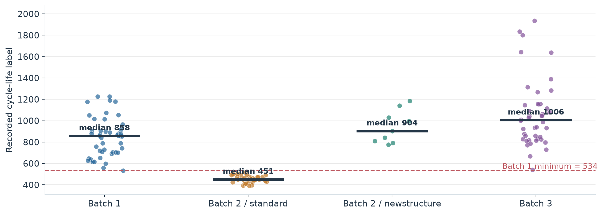
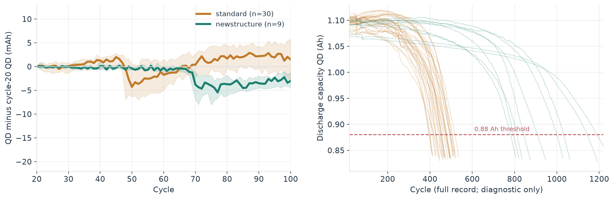
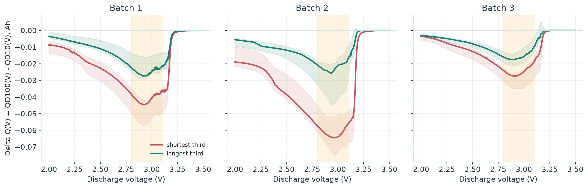
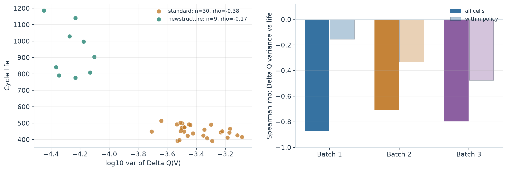
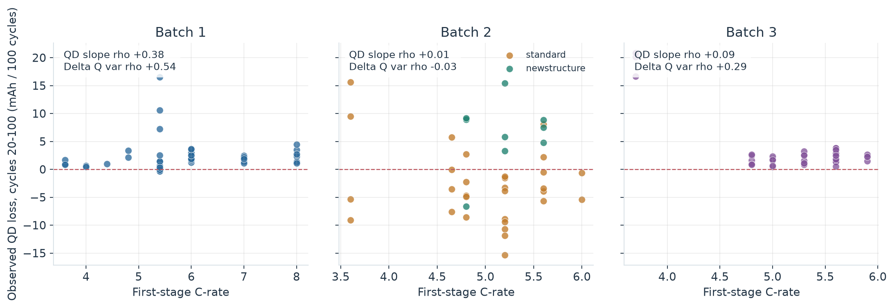

# ESS 배터리 수명 예측 — DAY 1 EDA와 모델 설계

**울산캠퍼스 2반 · 안동선**

**제출물:** [가로형 DAY 1 분석 PDF](deliverables/DS-MINI-Design-울산캠퍼스_2반-안동선.pdf)

**오늘의 범위:** 원본 3개 배치의 데이터 검증, 다섯 EDA 질문, 해석과 반례, DAY 2 모델·평가 설계. 모델 학습이나 성능 평가는 하지 않았다.

## 이번 분석의 결론

초기 100사이클에서 전압별 방전 곡선 변화 `ΔQ(V)`는 수명과 강하게 연결돼 보인다. 그러나 그 상관은 **충전 정책과 Batch 2 구조 표기 차이를 통제하면 크게 약해진다.** Batch 1에서 `log10 var(ΔQ)`와 기록 수명의 Spearman 상관은 전체 `−0.87`, 정책 내부 `−0.15`다. Batch 2도 전체 `−0.71`이지만 일반형 30셀 안에서는 `−0.38`, `newstructure` 9셀 안에서는 `−0.17`이다. 따라서 이 신호를 확정된 핵심 피처라고 부르기보다 **정책 변수를 추가했을 때에도 남는 예측 이득**을 DAY 2에 검증해야 한다.

Batch 2의 39개 숫자 레이블 중 짧은 수명 30셀은 일반형 프로토콜에 집중된다. 이 30셀은 모두 Batch 1 최단 수명 534사이클보다 짧다. `newstructure` 9셀의 수명 중앙값은 904사이클로 일반형 451사이클과 다르다. 이는 새 배치에서의 **수명 범위 외삽과 실험 조건 이동**을 동시에 보여준다. `newstructure` 명칭만으로 구조의 인과효과를 단정하지 않는다.

모델의 1순위는 **소수 피처의 Ridge 수명 회귀**다. `log10 var(ΔQ)` 1개와 첫·둘째 C-rate, 전환 SOC를 출발점으로 하되, `ΔQ만 / 정책만 / 결합`을 같은 정책 그룹 검증에서 비교한다. 더 복잡한 모델의 채택 조건과 레이블 민감도 점검도 미리 정했다.

## 원본, 분모, 실행 방법

| 과제상 배치 | 원본 `.mat` | 전체 셀 | 숫자 수명 레이블 | 역할 |
|---|---|---:|---:|---|
| Batch 1 | `2017-05-12_batchdata_updated_struct_errorcorrect.mat` | 46 | 46 | DAY 2 학습 후보 |
| Batch 2 | `2018-02-20_batchdata_updated_struct_errorcorrect.mat` | 47 | 39 | 과제 지정 외부 평가 |
| Batch 3 | `2018-04-12_batchdata_updated_struct_errorcorrect.mat` | 46 | 44 | 추가 일반화 진단 |

세 대상 배치에서 **139셀과 116,722개 사이클 요약 행**을 추출했다. 셀별 초기 100사이클 및 1,000점 전압 격자의 `ΔQ(V)`는 모두 존재한다. Batch 2의 숫자 레이블이 없는 `VarCharge` 4셀과 `SLOWCYCLE` 4셀, Batch 3의 레이블 없는 2셀은 수명 상관과 평가 분모에서 제외한다. 과제 외 `2018-04-03_varcharge_batchdata_updated_struct_errorcorrect.mat`는 `data/raw/extra/`에 보관하고 분석에서 제외한다. 사이클 행을 독립 학습 표본으로 늘리지 않는다.

```text
mini-project/
├── data/raw/                  # 사용자가 제공한 원본; Git 제외
├── data/processed/            # 셀·사이클·곡선 추출물; Git 제외
├── references/                # 노션 예시·원저자 자료; Git 제외
├── src/extract.py             # 원본에서 피처와 곡선 추출
├── src/eda.py                 # 기본 EDA·레이블·knee·정책 검증
├── src/day1_revision.py       # 반례·조건부 상관·초기 열화 추가 검증
├── src/build_day1_pdf.py      # 16:9 제출 PDF 생성
├── results/figures/           # 검토 가능한 그래프
├── results/tables/            # 그래프의 재현 수치
└── deliverables/              # 제출 PDF
```

```bash
python3 -m venv .venv
.venv/bin/pip install -r requirements.txt
.venv/bin/python src/extract.py --batch2 notion
.venv/bin/python src/eda.py
.venv/bin/python src/day1_revision.py
.venv/bin/python src/build_day1_pdf.py
```

분석은 Python 3.14.6과 [고정 의존성](requirements.txt)에서 실행했다. 공개 저장소에는 원본·가공 데이터, 전사본, 노션 첨부 이미지를 올리지 않는다. PDF, 그림, 집계 수치, 재현 코드는 공개한다.

### 먼저 확인한 레이블의 의미

| 점검 | Batch 1 | Batch 2 | Batch 3 |
|---|---:|---:|---:|
| 숫자 레이블과 실제 첫 `QD < 0.88 Ah` 교차 일치 | 0/46 | **39/39** | 0/44 |
| 숫자 레이블 = 기록 길이 + 1 | **46/46** | 0/39 | **44/44** |
| 마지막 QD ≤ 0.885 Ah인 숫자 레이블 | 36/46 | 39/39 | 44/44 |

Batch 1·3의 숫자 레이블은 관측된 첫 0.88 Ah 교차가 아니다. Batch 1의 10셀은 마지막 QD가 **0.913~1.043 Ah**에서 끝나 잠재적 우측 검열로 본다. 나머지 Batch 1 36셀과 Batch 3 44셀은 종료에 가깝지만 직접 교차를 관측한 것은 아니다. 0.885 Ah는 원저자 코드의 *종료 근접* 점검선이고 EOL 기준은 0.88 Ah다. Batch 1 전체 46셀과 종료 근접 36셀의 분석을 함께 보고해야 한다. Huber 회귀가 이런 미관측 수명 문제를 바로잡지는 않는다.

원저자 `LoadData.m`은 두 번째 배치로 `2017-06-30` 파일을 쓰지만, [이번 과제](https://actually-war-1ea.notion.site/DS-Mini-Project-32d7f4c8669380338a27f90c471c1fcb)는 `2018-02-20` 파일을 지정한다. 따라서 논문 9.1% MAPE는 동일 분할의 직접 재현 기준이 아니다.

## Q1. 짧은 수명은 어디에 모였나?



Batch 1·2·3의 수명 중앙값은 858.5·472·1005.5사이클이다. Batch 2에서 500사이클 미만은 28/39, Batch 1은 0/46이다. Batch 2의 일반형 30셀은 392~514사이클이고, `newstructure` 9셀은 777~1186사이클이다. **Batch 1에서는 550 미만이 단 1셀**이므로 이진 분류를 학습 문제로 잡지 않고 초기 100사이클 기반 수명 회귀를 선택했다. 외부 평가에는 Batch 1 최솟값 534 아래의 30셀을 별도 오차 구간으로 둔다.

동일 기본 C-rate 문자열이 있는 세 쌍을 맞춰 보면 `newstructure`의 평균 수명은 각각 **+388 / +484 / +543사이클**이다. 같은 전류 문자열에서 생긴 이 차이는 전류 하나로 수명을 설명할 수 없음을 보여준다. 어떤 실험 조건이 `newstructure`와 함께 달라졌는지는 원본 문자열만으로 분리할 수 없다.

## Q2. 초기 용량 변화와 사후 knee는 무엇을 말하나?



초기 변화율은 셀마다 20~100사이클의 `QD ~ cycle` 선형 기울기를 구하고 `−100`을 곱한 **관측 QD 감소량(Ah/100사이클)**으로 정의했다. 음수는 그 구간에서 QD가 증가했다는 뜻이다. 이 값은 *비가역적 열화 속도의 직접 측정치가 아니다*. Batch 2 일반형의 중앙값은 **−3.7 mAh/100사이클**, `newstructure`는 **+7.5 mAh/100사이클**이다. 관측값의 일시적 흔들림에 강한 Theil–Sen 기울기로 바꿔도 일반형 **−4.0**, `newstructure` **+3.8 mAh/100사이클**로 방향은 같다. 그런데 최종 수명 중앙값은 일반형 451, `newstructure` 904사이클로 반대 순서다. 초기 용량이 조금 올라가는 것을 긴 수명의 증거로 해석할 수 없다.

전체 미래 곡선에 7사이클 이동 중앙값과 두 직선 분할을 적용한 탐색적 knee는 Batch 1 **45/46**, Batch 2 **39/39**, Batch 3 **44/44**에서 잡혔다. 거의 모든 셀에서 검출되므로 검출 여부 자체는 구분력이 작고, 100사이클 시점에는 미래 곡선을 볼 수 없으므로 **knee를 예측 입력에서 제외**한다. 분할 규칙에 의존한 설명용 결과이지 확정된 물리적 knee가 아니다.

단순 `QD100 − QD10`과 수명의 상관은 Batch 1 **+0.61**, Batch 2 **−0.05**, Batch 3 **+0.03**이다. Batch 1에서만 보이는 신호라 주 피처에서 보류하고, 전압 위치별 변화인 `ΔQ(V)`를 검토한다.

## Q3. ΔQ(V)의 신호는 정책을 넘어서 남나?



물리적 10번·100번 사이클의 동일한 3.5→2.0 V, 1,000점 격자에서 `ΔQ(V)=Qdlin[99]−Qdlin[9]`를 계산했다. 짧은 수명 1/3 집단은 세 배치 모두 약 2.8~3.1 V에서 더 음수인 ΔQ를 보인다. 그러나 이 집단 구분은 수명 레이블을 이용한 **설명용 그림**이고, Batch 2에서는 구조 차이와도 겹친다.



| `log10 var(ΔQ)` ↔ 기록 수명 Spearman ρ | Batch 1 | Batch 2 | Batch 3 |
|---|---:|---:|---:|
| 모든 레이블 셀 | **−0.87** | **−0.71** | **−0.80** |
| 정책별 평균 제거 후 | **−0.15** | **−0.33** | **−0.47** |

Batch 2 일반형 내부에서는 **−0.38(n=30)**, `newstructure` 내부에서는 **−0.17(n=9)**로 전체보다 약하다. Batch 1 정책을 통째로 재표집한 정책 내부 상관 95% 구간은 **−0.50~+0.22**다. `ΔQ` 분산이 정책의 대리 변수인지, 같은 정책 안에서도 수명을 가르는 정보인지 확인해야 한다. Batch 1에서 ΔQ 평균과 분산의 상관도 `−0.97`이라 요약값을 여러 개 동시에 넣지 않는다. 첫 곡선 피처는 `log10 var(ΔQ)` **한 개**로 제한하고, `ΔQ만 / 정책만 / 결합` 제거 실험으로 증분 이득을 판단한다.

## Q4. 충전 전류 패턴은 초기 열화와 어떻게 연결되나?



| Spearman ρ, 첫 단계 C-rate와의 관계 | Batch 1 | Batch 2 | Batch 3 |
|---|---:|---:|---:|
| 기록 수명 | −0.48 | +0.06 | −0.23 |
| 20~100사이클 관측 QD 감소 기울기 | **+0.38** | **+0.01** | **+0.09** |
| `log10 var(ΔQ)` | **+0.54** | **−0.03** | **+0.29** |

첫 C-rate와 초기 QD 감소의 관계는 Batch 1에서만 보이며, ΔQ 형태 변화와의 관계도 Batch 2에서는 사라진다. Theil–Sen 기울기로 재계산해도 첫 C-rate 상관은 **+0.38 / +0.04 / +0.14**로 결론이 같다. 전환 SOC와 관측 QD 감소 기울기의 상관은 **−0.09 / +0.00 / −0.40**, 둘째 C-rate와는 **+0.09 / +0.16 / +0.27**이다. 전류 패턴을 첫 C-rate 숫자 하나로 요약해 안정적 열화 효과라고 해석할 근거가 약하다. Batch 2 일반형과 `newstructure`의 초기 QD 기울기·ΔQ 분산·수명은 동일한 기본 정책에서도 함께 달라지므로, 이 상관은 인과적 충전 전류 효과가 아니다.

## Q5. 피처를 어떻게 남길 것인가?

| 후보 | EDA에서 드러난 문제 | DAY 2 선택 |
|---|---|---|
| `log10 var(ΔQ)` | 배치별 전체 상관은 강하나 정책 내부에서 약해짐 | 곡선 대표 1개, 정책을 더한 뒤에도 이득이 남는지 검증 |
| 첫·둘째 C-rate, 전환 SOC | 정책·구조가 엮여 있고 배치별 상관이 바뀜 | 숫자형 정책 입력 후보, 정책 홀드아웃에서 확인 |
| `QD100 − QD10` | 수명 상관 +0.61/−0.05/+0.03 | 주 모델에서 제외 |
| 평균 충전 시간 | 수명 상관 +0.61/−0.39/+0.19 | 주 모델에서 제외; 정책 대리 여부 진단 |
| 온도·IR 변화 | 수명 상관 방향·크기가 불안정 | 주 모델에서 보류 |
| ΔQ 평균·최솟값 추가 | 분산과 높은 중복 | 한 개씩 대체 민감도만 검토 |

## DAY 2에 실행할 모델·검증 계획

**예측 시점과 목표:** 100사이클까지 관측한 입력으로 셀의 기록된 전체 `cycle_life`를 회귀한다. ESS 맥락에서는 과대 예측이 교체 지연으로 이어질 수 있어 오차 방향도 본다. `cycle_life−100`을 잔여 수명으로 표시할 수 있지만 과제 지표는 전체 수명으로 고정한다.

**1순위 모델:** 학습 폴드에서만 스케일링한 `log10 var(ΔQ)` 1개 + 첫·둘째 C-rate + 전환 SOC의 **Ridge 회귀**. 학습 독립 단위가 46셀이고 ΔQ 통계 간 중복이 크기 때문이다. 정규화 강도는 Batch 1 내부 정책 그룹 CV에서 선택한다. 학습 폴드의 수명 중앙값 예측을 기준선으로 둔다. `ΔQ만 / 정책만 / 결합` Ridge를 동일 분할에서 비교하고 결합이 낫지 않으면 더 단순한 입력을 채택한다. 기준선보다 낫지 않으면 이 자료에서 예측이 입증됐다고 주장하지 않는다.

**대체 조건:** 훈련 폴드의 잔차에서 굽은 형태나 정책×ΔQ 상호작용이 반복되고, 깊이를 제한한 트리가 4개 정책 CV 폴드 중 **3개 이상에서** Ridge보다 MAPE를 낮출 때만 비교한다. Huber는 극단값의 영향 민감도 점검용이다. 미관측 EOL 레이블을 수정하는 방법으로 설명하지 않는다. Batch 1의 전체 46셀과 종료 근접 36셀 분석이 뒤집히면 레이블 문제를 먼저 보고한다.

**분할과 보고:** Batch 1의 23개 정책 중 약 20%를 그룹 홀드아웃하고 나머지에 4-fold `GroupKFold`를 사용한다. 전처리·피처 선택·하이퍼파라미터 선택은 학습 폴드 안에서 한다. 선택 후 Batch 1 홀드아웃을 확인하고, 과제 지정 Batch 2의 레이블 39셀에 고정 모델을 적용한다. `Train(CV) / Valid / Test`의 MAPE와 MAE, 실제 수명 `<534` 구간의 오차·과대 예측률, Batch 2 일반형 30셀과 `newstructure` 9셀의 오류를 따로 보고한다. Batch 3은 추가 일반화 진단으로 둔다. DAY 1 EDA에서 Batch 2·3 레이블을 이미 살펴봤으므로 Batch 2 평가는 **완전한 블라인드 테스트가 아니다**.

**현장 해석:** 이 자료는 빠른 충전 조건의 실험실 LFP/흑연 소형 셀이다. ESS의 불규칙 부하, 팩/랙 구조, 제조사, 실제 온도 범위가 포함되지 않는다. 수명 예측 정확도를 ESS 교체 비용 절감률로 바로 환산하지 않는다.

## 출처

- [노션 과제 안내, 다섯 질문, 평가기준, EDA 예시](https://actually-war-1ea.notion.site/DS-Mini-Project-32d7f4c8669380338a27f90c471c1fcb)
- [Severson et al., *Nature Energy* (2019)](https://www.nature.com/articles/s41560-019-0356-8)
- [공개 원자료](https://data.matr.io/1/projects/5c48dd2bc625d700019f3204)
- [원저자 MATLAB 처리 코드](https://github.com/rdbraatz/data-driven-prediction-of-battery-cycle-life-before-capacity-degradation)

강의 전사본을 평가 의도와 제출 범위 해석에 참고했다. 원본·전사본·노션 첨부 이미지는 로컬에만 보관한다.
